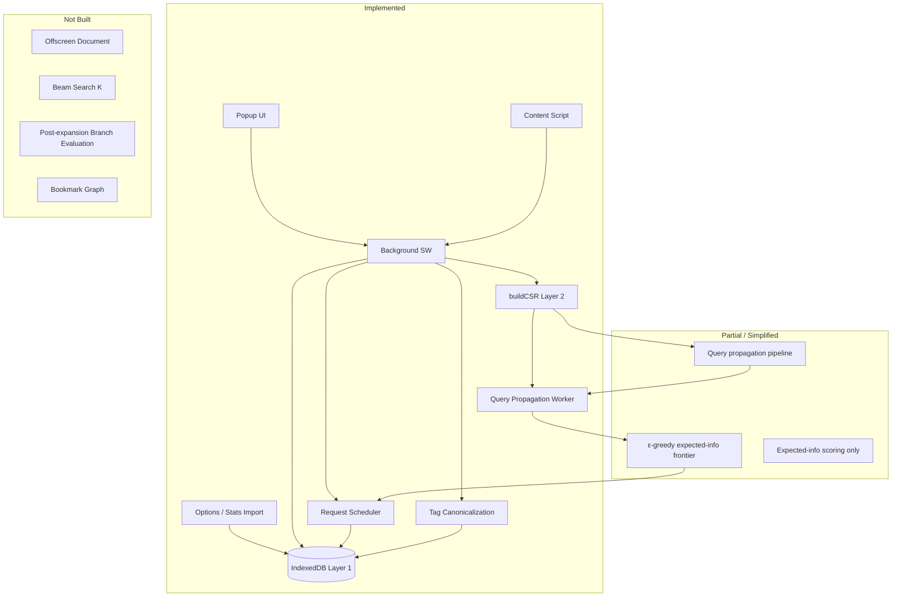

# Overall status

This is a working MVP browser extension (WXT, Chrome/Firefox MV3) that implements the core loop: build a sparse AO3 graph incrementally, run query propagation (relevance, authority, precision) from seed works/tags/authors, expand one unexplored node per request, and return ranked work results. The algorithm has evolved significantly since the first MVP: standalone Personalized PageRank has been replaced by a multi-signal propagation framework with expected-information frontier selection. Graph persistence, stats import, and tag canonicalization have also been added.

---

## Implemented (matches or advances the design)

### Browser extension shell

- **Background service worker** (`entrypoints/background.ts`): seed state, message routing, search lifecycle, graph ingestion, graph import/export, stats-import coordination.
- **Content script** (`entrypoints/content/ao3.content.ts`): scrapes work/tag/author pages the user visits and sends them to the background; adds on-page “Add as seed” / “Avoid” buttons for all three node types.
- **Popup UI** (`entrypoints/popup/main.ts`): manage positive and negative seeds (works, tags, authors), tag autocomplete from the local graph, start/cancel search, view progress and results, export/import graph JSON.
- **Options page** (`entrypoints/options/main.ts`): import AO3 official stats dump (`tags-YYYYMMDD.csv`) to calibrate tag frequencies and apply canonical tag merges.
- **Dark mode** (`src/ui/theme.css`): shared theme used by popup and options.

### Graph model & storage (Layer 1)

- Work, tag, and author nodes with interned integer IDs in IndexedDB (`src/storage/db.ts`, schema version 5).
- Work ↔ tag and author ↔ work edges stored persistently; graph grows only through fetched or passively scraped pages (no bulk crawl).
- Explored vs unexplored node tracking drives the expansion frontier.
- **Graph import/export** (`src/storage/graphIo.ts`): JSON snapshot with merge or overwrite modes.
- **Stats metadata store**: AO3 tag dump records (IDs, canonical links, cached counts) for lookup and calibration.
- **Tag canonicalization** (`src/storage/tagCanonical.ts`): merges synonym/alias tag nodes in the graph using stats-dump merger chains; resolves tag names when ingesting pages and seeds.

### Weighted graph (Layer 2)

- CSR sparse representation (`src/graph/csr.ts`) built from the snapshot on each search iteration.
- Hub-dampening transition weights: `1 / log(frequency)` for work→tag and work→author transitions, with uniform distribution for tag/author→work.
- **Frontier bias** (`rowOutFraction` in `src/graph/outgoingOrder.ts`): unexplored high-degree nodes get reduced outgoing mass so partially observed hubs do not dominate walks.
- Lazy frequency calibration: visiting a tag or author page sets `calibratedFreq` from AO3’s work count; until then, `estimatedFreq` is incremented locally as edges are discovered. Stats import can bulk-calibrate known tags.

### Query propagation (replaces standalone PPR)

The old `src/ppr/` module has been removed. Ranking and frontier scoring now live in `src/propagation/`:

- **Propagation engine** (`src/propagation/engine.ts`): generic iterative sparse-graph propagation with pluggable signals.
- **Query pipeline** (`src/propagation/runQueryPropagation.ts`):
  1. Build non-uniform priors (work word count, author aggregation, tag fallback).
  2. Run **authority** propagation (global PageRank with prior teleport).
  3. Run **relevance** propagation (seed-weighted teleport, authority-weighted receivers, signed edges for negatives).
  4. Compute **tag flux** priors from the relevance vector and refine authority.
  5. Compute **precision** (prior + one authority-weighted spread) and **expected information** `relevance × authority / (precision + ε)`.
- Runs in a dedicated Web Worker (`src/propagation/propagation.worker.ts` via `src/compute/host.ts`).
- Recomputed after every graph expansion (compute-for-fewer-requests philosophy is followed).

### Request scheduling

- Single scheduler (`src/scheduler/scheduler.ts`) owns all AO3 fetches.
- Rate limiting (2.5s + jitter), retries on 429/5xx, parsing via HTML fetch (not tab navigation).
- Can expand work, tag, and author nodes.
- Tag/author page fetches include work listing metadata (titles, word counts where available) to enrich the graph without extra per-work requests.

### Search orchestration

- Cold start: fetch positive seeds (works, tags, or authors) and negative seeds if any.
- Progressive expansion loop (`src/search/orchestrator.ts`): query propagation → rank unexplored nodes by expected information → pick one → fetch → merge → repeat.
- **ε-greedy frontier selection** (95% highest expected information, 5% random) in `src/search/frontier.ts`.
- Stopping: request budget exhausted (`EXPANSION_BUDGET = 20`), empty frontier, or max frontier expected information below threshold (`MIN_FRONTIER_EXPECTED_INFO`).
- Work results ranked by **relevance**; frontier targets **expected information**.

### Seeds & negative queries

- Positive seeds: works, tags, or authors (popup, content script, tag autocomplete).
- Negative seeds: works, tags, or authors.
- Signed adjacency at query time (`src/graph/signedQuery.ts`): edges touching negative seeds are negated; teleport vector includes negative sinks.
- Supports queries like “Time Travel without Major Character Death” in principle.

### AO3 parsing & tests

- Parsers for work, tag, and author pages (`src/ao3/`); stats dump CSV streaming (`src/ao3/statsDump.ts`, `streamTextFile.ts`).
- **57 tests across 19 files** (Vitest): propagation (engine, signals, priors, tag flux, precision, query pipeline), CSR, frontier, signed queries, parsers, stats import, tag canonicalization, graph I/O.

---

## Half-implemented or simplified vs the design

| Design concept | Current state |
|---|---|
| Personalized PageRank as the sole ranking signal | **Superseded.** Relevance is still query PPR, but authority and precision are separate signals; frontier uses expected information, not raw PPR authority. UI copy still says “Personalized PageRank” in places. |
| Author nodes | **Fully implemented** (seeds, negatives, edges, expansion, priors). Design doc “Future V2” section is stale. |
| Cold-start local co-occurrence prior | Implicit only: shared seed tags raise `estimatedFreq`, affecting hub weights. No explicit seed-co-occurrence weighting on the teleport vector or dedicated cold-start phase beyond fetching seeds. |
| 3–5 seed works | Popup allows 1–5 seeds (`MIN_SEEDS = 1`); design recommends 3–5. Tag and author seeds reduce the need for multiple work seeds but the minimum is still 1. |
| Layer 3 — Query Graph | Partial: `runQueryPropagation` is a coherent query-layer pipeline and returns relevance/authority/precision/expectedInfo vectors, but there is no persistent query-graph object or cached propagation state between iterations—each loop rebuilds CSR and reruns the full pipeline. |
| Exploration strategy (beam search) | ε-greedy only. No maintained top-K frontier beam; selection is from the full unexplored set sorted by expected information. |
| Information gain for expansion | **Partially implemented.** Expected-information scoring (`relevance × authority / precision`) guides frontier ranking, matching the design’s formula. Post-expansion branch evaluation (score change, newly promoted nodes, authority redistribution) is not implemented. |
| Stopping conditions | Three of four: budget, frontier expected-info threshold, empty frontier. Missing: relevance-distribution convergence check across expansion iterations. (Per-signal propagation still converges internally via tolerance.) |
| Offscreen document | Not used. Propagation worker is spawned directly from the service worker. |
| Passive browsing enrichment | Works when idle, but disabled during an active search (`ingestPageData` returns early if searching). |
| Maximize info per request | Tag/author listing pagination is implemented; hubs stay `partial` until exhausted. Stale complete hubs can be demoted when AO3 work counts grow. `/works/search` is available on the request handler but unused by the default expansion policy. |
| Synonym discovery | Emergent in the algorithm (similar tags share authority) plus explicit tag merges via stats dump. No UI or analytics for surfacing synonym clusters. |
| Global rarity × local enrichment | Only basic `calibratedFreq ?? estimatedFreq` weighting; no combined rarity×enrichment experiments. |

---

## Not implemented (design doc only)

These appear in `docs/design.md` but have no corresponding code:

1. Bookmark graph (reader → work connections).
2. Offscreen document as the compute coordinator (architecture: background → Web Worker).
3. Beam search with a maintained top-K frontier.
4. Branch evaluation metrics after each expansion (average score change, newly promoted frontier nodes, authority redistribution).
5. Convergence-based early termination of the **search loop** (stop when relevance stabilizes across expansions).
6. Global rarity × local enrichment weighting experiments.
7. Explicit query-graph lifecycle with cached propagation state between iterations.
8. Synonym/tag-equivalence UI or analytics layer.

---

## Planned platform support (not started)

### Firefox for Android

Desktop Chrome and Firefox are the current targets. Firefox for Android compatibility is a **planned follow-up**, not implemented or device-tested.

**Why it might work without major rewrites**

- WXT’s Firefox build emits `background.scripts` (event-page style), not a service worker — required for MV3 on Android.
- Permissions and APIs in use (`storage`, `tabs`, `scripting`, content scripts, `runtime` messaging, IndexedDB, Web Workers) are generally available on Fenix.
- No dependency on desktop-only extension APIs.

**Why it is not supported yet**

| Risk | Detail |
|---|---|
| Content scripts | Passive ingestion and on-page seed buttons depend on MV3 content scripts; Fenix had historical gaps around injection and host-permission prompts. |
| Host permissions | `host_permissions` for `archiveofourown.org` may be auto-granted on Android with poor visibility; failed grants would break background `fetch` during search. |
| Background suspension | Search runs for tens of seconds in the background; Android kills idle extension processes — no resume logic today. |
| AO3 mobile markup | `src/ao3/selectors.ts` targets desktop DOM; mobile AO3 pages may parse incorrectly. |
| Mobile UX | Popup is a fixed 360×560px panel; file export (`<a download>`) and stats/graph import may need mobile-specific handling. |
| Distribution | End users install Android extensions from AMO’s curated set; sideloading requires USB + `web-ext run -t firefox-android`. |

**Likely work before shipping**

1. Device test on recent Firefox for Android (content scripts, search loop, permissions).
2. Add `gecko_android.strict_min_version` to `wxt.config.ts` and run Android-aware lint.
3. Verify or adapt AO3 parsers against mobile page HTML.
4. Harden search against background kills (persist/resume expansion state).
5. Responsive popup/options pass; AMO listing if publishing to Android users.

---

## Architecture vs the doc (conceptual map)

---

## Practical takeaway

You have an end-to-end semantic search MVP with a substantially richer ranking model than the original PPR-only prototype: pick seeds (works, tags, or authors), optionally add negative tags/works/authors, run a budgeted graph expansion with multi-signal propagation, and get ranked recommendations. The graph can be exported/imported and enriched via AO3’s stats dump for better tag calibration and canonical merges.

The pieces that most distinguish the full design—beam search, post-expansion branch evaluation, convergence-based search stopping, offscreen compute routing, and bookmark-based edges—are still on paper. The biggest positive shifts since the last status write-up are the **relevance/authority/precision propagation stack**, **expected-information frontier selection**, **author and tag seeds end-to-end**, **stats dump import**, and **graph import/export with tag canonicalization**.

---

*Last updated: July 2026. See `docs/design.md` for the current algorithm specification.*
